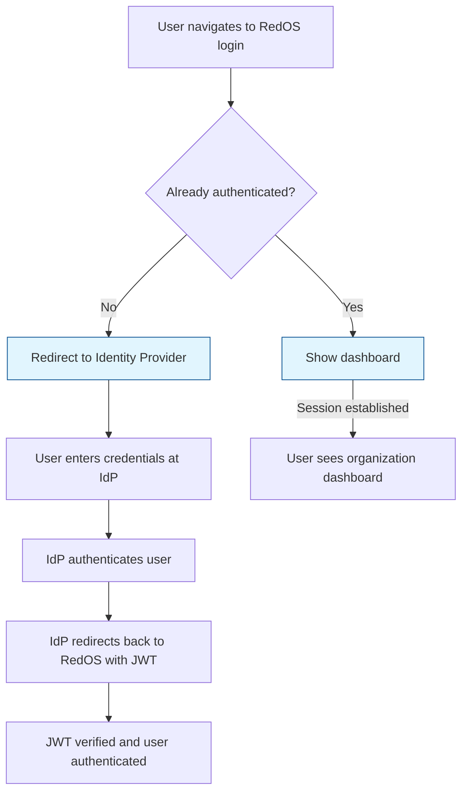

# RedOS Enterprise Identity

## Overview

Enterprise identity integrations provide production-grade authentication and access control
for RedOS. The system supports SSO, OIDC, SAML, service identities, and scoped tokens
with organization-level policies.

## Identity Providers

### Supported Identity Providers

| Provider | Protocol | Status | Configuration Complexity |
|----------|----------|--------|------------------------|
| **Keycloak** | OIDC/SAML | ✅ Supported | Medium |
| **Auth0** | OIDC | ✅ Supported | Low |
| **Azure AD** | OIDC/SAML | ✅ Supported | Medium |
| **Google Workforce** | OIDC | ✅ Supported | Low |
| **GitHub Enterprise** | OIDC | ✅ Supported | Low |
| **Custom SAML** | SAML 2.0 | ✅ Supported | Medium |
| **LDAP** | Direct bind | ⚠️ Read-only | High |

### OIDC Configuration

```yaml
# OIDC identity provider configuration
identity_providers:
  keycloak:
    enabled: true
    provider_name: "Keycloak"
    client_id: "redos-client"
    client_secret: "client-secret-xxx"
    issuer_url: "https://keycloak.example.com/auth/realms/redos"
    authorization_endpoint: "https://keycloak.example.com/auth/realms/redos/protocol/openid-connect/auth"
    token_endpoint: "https://keycloak.example.com/auth/realms/redos/protocol/openid-connect/token"
    userinfo_endpoint: "https://keycloak.example.com/auth/realms/redos/protocol/openid-connect/userinfo"
    jwks_uri: "https://keycloak.example.com/auth/realms/redos/protocol/openid-keys/jwks"
    
    # Scope mapping
    scopes:
      - "openid"
      - "profile"
      - "email"
      - "redos.fleet.read"
      - "redos.fleet.write"
      - "redos.campaigns.read"
      - "redos.campaigns.write"
    
    # Claim mapping
    claims_mapping:
      preferred_username: "preferred_username"
      email: "email"
      full_name: "name"
      organization_id: "organization_id"
      role: "role"
    
    # Group mapping to RedOS roles
    group_mapping:
      "redos.admin": "super_admin"
      "redos.org_admin": "org_admin"
      "redos.project_admin": "project_admin"
      "redos.user": "user"
      "redos.viewer": "viewer"
```

### SAML Configuration

```yaml
# SAML identity provider configuration
identity_providers:
  okta:
    enabled: true
    provider_name: "Okta"
    entity_id: "https://okta.example.com/saml/metadata"
    acs_url: "https://okta.example.com/saml2/service-provider/metadata/acs"
    sso_url: "https://dev-123456.okta.com/app/exkq5y0x5z6BobpQI12/sso/saml"
    certificate: "-----BEGIN CERTIFICATE-----\n...\nEND CERTIFICATE-----"
    
    # Attribute mapping
    attribute_mapping:
      email: "email"
      full_name: "full_name"
      organization_id: "organization_id"
      role: "role"
    
    # Group to role mapping
    group_role_mapping:
      "admin-group": "super_admin"
      "org-admin-group": "org_admin"
      "project-admin-group": "project_admin"
      "user-group": "user"
      "viewer-group": "viewer"
```

## Service Identities

### Service Identity Attributes

| Attribute | Type | Description |
|-----------|------|-------------|
| `id` | UUID | Unique identifier |
| `name` | String | Service name (e.g., "ci-pipeline", "autogpt-runner") |
| `type` | Enum | `ci_cd`, `automation`, `integration`, `system` |
| `api_key` | String | Generated API key (sensitive) |
| `scopes` | Array | Permitted actions/resources |
| `organization_id` | UUID | Owning organization |
| `created_by` | UUID | User who created the identity |
| `created_at` | DateTime | Creation timestamp |
| `expires_at` | DateTime | Expiration timestamp |
| `last_used_at` | DateTime | Last usage timestamp |
| `failure_count` | Integer | Consecutive authentication failures |
| `status` | Enum | `active`, `revoked`, `expired`, `paused` |

### Service Identity API

```python
from redos.identity import ServiceIdentityManager

manager = ServiceIdentityManager(org_id="org_456")

# Create service identity
identity = await manager.create_identity(
    name="ci-pipeline",
    type="ci_cd",
    scopes=[
        "findings:create",
        "findings:view",
        "campaigns:start",
        "campaigns:view",
        "evidence:view",
    ],
    expires_at="2025-01-15T00:00:00Z",
)

print(f"Identity ID: {identity.id}")
print(f"API Key: {identity.api_key}")
print(f"Expires: {identity.expires_at}")

# Use identity for API calls
from redos.identity import authenticate_identity

auth_result = await authenticate_identity(identity.api_key)
print(f"Authenticated: {auth_result['authenticated']}")
print(f"Scopes: {auth_result['scopes']}")
print(f"Organization: {auth_result['organization_id']}")
```

### Scoped Tokens

```python
from redos.identity import TokenManager

token_manager = TokenManager(org_id="org_456")

# Create scoped token with limited duration and permissions
token = await token_manager.create_scoped_token(
    identity_id="identity_abc123",
    scopes=["findings:view", "campaigns:view"],
    expires_in_minutes=120,
    purpose="dashboard_access",
)

# Token can be used for API calls
api_response = await make_api_call(
    headers={"Authorization": f"Bearer {token}"},
    endpoint="/api/v1/findings",
)

# Token automatically expires after 120 minutes
# Can be revoked early if needed
await token_manager.revoke(token.id)
```

### Organization-Level Policies

```yaml
# Organization identity policies
identity_policies:
  require_mfa:
    enabled: true
    applicable_roles: ["super_admin", "org_admin"]
    
  session_timeout_minutes: 480  # 8 hours
  
  # Token rotation
  access_token_lifetime_minutes: 480  # 8 hours
  refresh_token_lifetime_days: 30
  
  # SSO configuration
  sso:
    display_name: "RedOS Enterprise SSO"
    login_button_text: "Login with Identity Provider"
    
  # Password policy (for local accounts)
  password_policy:
    minimum_length: 12
    require_uppercase: true
    require_lowercase: true
    require_numbers: true
    require_symbols: true
    max_age_days: 90
    history_count: 5
    
  # MFA configuration
  mfa:
    enabled: true
    methods: ["totp", "webauthn"]
    required_roles: ["super_admin", "org_admin"]
    backup_codes_enabled: true
    backup_codes_count: 10
```

### Identity Provider Integration APIs

| Integration | Protocol | Key Endpoints | Setup |
|-------------|----------|---------------|-------|
| **Keycloak** | OIDC/SAML | `/auth`, `/token`, `/userinfo` | Medium |
| **Auth0** | OIDC | `/authorize`, `/token`, `/userinfo` | Low |
| **Azure AD** | OIDC/SAML | `/oauth2/v2.0/authorize`, `/token`, `/userinfo` | Medium |
| **Okta** | OIDC/SAML | `/authorize`, `/token`, `/userinfo` | Low |
| **Custom SAML** | SAML 2.0 | `/sso`, `/validate`, `/logout` | High |

### SSO Login Flow



### MFA & 2FA

```yaml
# MFA configuration
mfa:
  enabled: true
  methods:
    totp:      # Time-based One-Time Password
      enabled: true
      issuer: "RedOS Security"
    webauthn:  # FIDO2 / security key
      enabled: true
      allow_untrusted_devices: false
    backup_codes:
      enabled: true
      count: 10
      single_use: true
  
  # MFA required for specific roles
  required_roles: ["super_admin", "org_admin"]
  
  # Conditional MFA
  conditional:
    risk_score_threshold: 0.7
    trusted_devices: true
    geolocation_check: false
```

### Identity Audit Logging

```json
{
  "event_type": "authentication",
  "user_id": "user_abc123",
  "identity_provider": "keycloak",
  "success": true,
  "mfa_used": true,
  "ip_address": "192.168.1.100",
  "user_agent": "Mozilla/5.0 Firefox",
  "organization_id": "org_456",
  "session_id": "sess_xyz789",
  "actions": [
    "view_findings",
    "create_campaign",
    "manage_gates"
  ],
  "timestamp": "2024-01-15T10:30:00Z",
  "session_lifetime_minutes": 480
}
```

### Identity Migration

```python
from redos.identity import IdentityMigrator

migrator = IdentityMigrator(
    source_idp="keycloak_source",
    target_idp="okta_target",
    org_id="org_456",
)

# Migrate users
results = await migrator.migrate_users(
    user_emails=["alice@example.com", "bob@example.com"],
    merge_accounts=True,
)

print(f"Migrated: {results['migrated']}")
print(f"Skipped: {results['skipped']}")
print(f"Failed: {results['failed']}")

# Map existing API keys and service identities
key_results = await migrator.migrate_identities()

print(f"Keys migrated: {key_results['migrated']}")
print(f"Service identities: {key_results['service_identities']}")
```