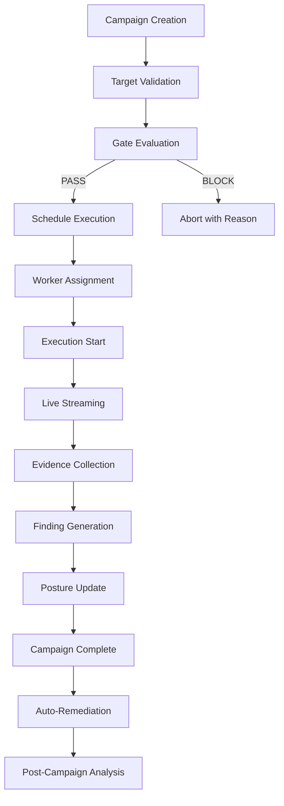

# RedOS Fleet Architecture

## Overview

RedOS Fleet manages multiple concurrent targets, agents, and RAG systems under organizational
control. The fleet provides centralized security posture tracking across all projects and
ensures tenant isolation while enabling efficient distributed execution.

## Fleet Topology

### Organization Structure

```
Organization (tenant boundary)
├── Project A
│   ├── Agent 1 (AutGPT, AutoGen, etc.)
│   ├── Agent 2 (BabyAGI, LangGraph, etc.)
│   ├── RAG System (LlamaIndex, Weaviate, Chroma)
│   └── Target Configuration
│
├── Project B
│   └── Agent Framework (Custom/Generic)
│
└── Project C
    └── Model API (OpenAI, Anthropic, Ollama, Custom)
```

### Key Concepts

| Concept | Description | Isolation |
|---------|-------------|-----------|
| **Organization** | Top-level tenant boundary | Complete data isolation |
| **Project** | Logical grouping of targets/agents | Database-level isolation via org_id |
| **Target** | Individual red team target | Org + project scoped |
| **Agent** | Execution framework instance | Configurable per-project |
| **RAG System** | Retrieval-augmented generation | Org + project scoped |
| **Campaign** | Coordinated attack execution | Full provenance tracking |
| **Execution** | Individual attack run | Full provenance + evidence |

### Fleet Components

| Component | Responsibility | Scale |
|-----------|---------------|-------|
| **Fleet Manager** | Orchestration, posture tracking | 100+ organizations |
| **Campaign Scheduler** | Triggered execution planning | 1000+ campaigns/day |
| **Worker Pool** | Distributed execution | 50+ concurrent workers |
| **Target Registry** | Target discovery and health | 500+ active targets |
| **Evidence Store** | Evidence persistence and retrieval | Petabytes |
| **Posture Engine** | Centralized security scoring | Real-time |

### Target Registry

Each target in the fleet is registered with full metadata:

```yaml
# Target registry entry
target_id: "target_abc123"
organization_id: "org_456"
project_id: "project_alpha"
name: "RAG System - Production"
type: "rag_system"
model: "gpt-4o"
vector_store: "pinecone:production"
documents: 1500
status: "active"
security_posture: "medium"
last_scan: "2024-01-15T10:30:00Z"
last_health_check: "2024-01-15T10:00:00Z"
tags: ["rag", "prompt_injection", "production"]
```

### Tenant Isolation Enforcement

All fleet operations enforce tenant isolation through:

1. **Organization ID Filtering** - Every query includes `organization_id`
2. **Project ID Scoping** - Optional project-level filtering
3. **Target-Level ACLs** - Explicit access controls per target
4. **Agent Credentials** - Per-organization JWT tokens
5. **Evidence Ownership** - Finding/evidence ownership tracked via org_id/project_id

### Centralized Security Posture

The fleet maintains a consolidated security posture view:

```json
{
  "organization_id": "org_456",
  "posture_score": 7.5,  // 0-10, higher is better
  "posture_trend": " improving",  // improving/declining/stable
  "total_targets": 12,
  "active_targets": 10,
  "findings_by_severity": {
    "CRITICAL": 2,
    "HIGH": 5,
    "MEDIUM": 8,
    "LOW": 3
  },
  "campaigns_this_month": 24,
  "executions_running": 3,
  "executions_completed_24h": 18,
  "critical_findings_unaddressed": 2,
  "posture_factors": {
    "average_response_time": 45,  // minutes
    "scan_coverage": 85,  // percent of targets scanned
    "evidence_retention_compliance": 92,  // percent
    "gate_compliance": 98,  // percent of campaigns gated
    "mean_time_to_remediate": 72  // hours
  }
}
```

### Fleet Health Metrics

| Metric | Type | Alert Threshold |
|--------|------|-----------------|
| Target online rate | Ratio | < 90% |
| Scan success rate | Ratio | < 95% |
| Critical findings age | Hours | > 168 (7 days) |
| Worker utilization | Ratio | > 95% (overloaded) or < 30% (underutilized) |
| Gate blocking rate | Ratio | > 30% (too restrictive) |
| Evidence retention compliance | Ratio | < 90% |
| Mean time to remediate | Hours | > 120 |
```

## Fleet API Endpoints

| Method | Endpoint | Description |
|--------|----------|-------------|
| `GET` | `/api/v1/fleet/orgs` | List organizations user belongs to |
| `GET` | `/api/v1/fleet/orgs/{org_id}` | Get organization with posture |
| `GET` | `/api/v1/fleet/orgs/{org_id}/projects` | List projects in organization |
| `GET` | `/api/v1/fleet/orgs/{org_id}/projects/{proj_id}` | Get project with targets |
| `GET` | `/api/v1/fleet/orgs/{org_id}/projects/{proj_id}/targets` | List targets with health |
| `POST` | `/api/v1/fleet/orgs/{org_id}/projects/{proj_id}/targets` | Register new target |
| `PUT` | `/api/v1/fleet/orgs/{org_id}/projects/{proj_id}/targets/{target_id}` | Update target health |
| `POST` | `/api/v1/fleet/campaigns` | Create new campaign |
| `GET` | `/api/v1/fleet/campaigns` | List campaigns with filtering |
| `GET` | `/api/v1/fleet/campaigns/{campaign_id}` | Get campaign with provenance |
| `POST` | `/api/v1/fleet/campaigns/{campaign_id}/execute` | Execute campaign |
| `GET` | `/api/v1/fleet/posture` | Get organization posture snapshot |

### Fleet Initialization

```python
from redos.fleet import FleetManager

# Initialize fleet manager
fleet = FleetManager(
    organization_id="org_456",
    db_connection="mongodb://mongo:27017",
    redis_url="redis://redis:6379",
)

# Register targets
await fleet.register_target(
    name="RAG System - Production",
    target_type="rag_system",
    model="gpt-4o",
    vector_store="pinecone:production",
    tags=["rag", "production"],
)

# Get fleet posture
posture = await fleet.get_posture()
print(f"Organization posture: {posture['posture_score']}/10")
```

## Campaign Lifecycle



## Fleet Scaling

### Horizontal Scaling

```bash
# Scale worker pool
docker-compose up -d --scale redos-worker=10

# Verify scale
redos-cli fleet:status

# Auto-scaling (Kubernetes)
kubectl scale deployment redos-worker --replicas=10
```

### Fleet Monitoring

```bash
# Real-time fleet status
redos-cli fleet:monitor

# Export fleet posture
redos-cli fleet:export --format json --output fleet-posture.json

# Alert on posture degradation
redos-cli alert:posture --threshold 7.0
```