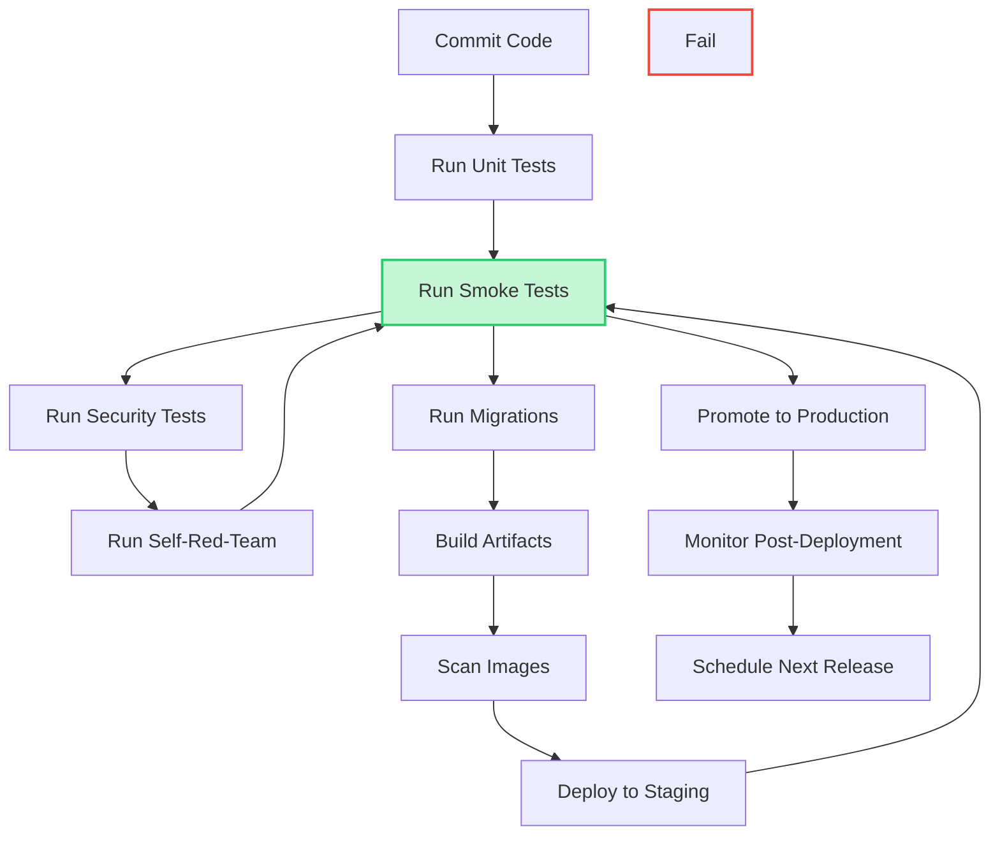

# RedOS Release Process

## Overview

This document defines the formal release pipeline for RedOS, incorporating security
gates, quality checks, and operational procedures to ensure reliable and secure
deployments.

## Release Pipeline Stages

### 1. Commit Stage

#### Pre-Commit Checks

```bash
# Pre-commit hook example
pre-commit run --all-files

# Verifies:
# - Code style (black, flake8)
# - Import sorting (isort)
# - Linting (ruff)
# - Type checking (mypy)
```

#### Commit Message Convention

```
feat: add new feature
fix: bug fix
docs: documentation changes
style: formatting, missing semicolons
refactor: code restructuring
test: adding missing tests
chore: updating dependencies
```

### 2. Unit Test Stage

#### Unit Test Execution

```bash
# Run unit tests
pytest tests/ -x -v --tb=short

# Coverage requirement
pytest tests/ --cov=security --cov-report=term-missing

# Minimum coverage threshold
# - Global: 80%
# - Critical paths: 95%
```

#### Unit Test Failures

If unit tests fail, the pipeline stops and requires:
1. Fix failing tests
2. Re-run pipeline
3. Document any test limitations

### 3. Integration Test Stage

#### Integration Test Execution

```bash
# Integration tests
pytest tests/ -x -v -k "integration"

# Docker-compose integration tests
docker-compose up -d test
docker exec -it test_container pytest

# Database integration tests
pytest tests/ -x -v -m integration
```

#### Integration Test Areas

- API endpoint functionality
- Database operations (CRUD)
- Authentication flow
- Worker job processing
- Evidence storage and retrieval
- Cross-tenant isolation verification

### 4. Security Test Stage

#### Security Test Execution

```bash
# Security-specific tests
pytest tests/ -x -v -k "security"

# Security scan
safety check --full

# Dependency vulnerability scan
pip-audit

# Secret detection
detect-secrets scan

# Run custom security tests
python -m security.audit
```

#### Security Test Checklist

- [ ] Authentication vulnerability tests
- [ ] Authorization bypass tests
- [ ] IDOR tests
- [ ] Privilege escalation tests
- [ ] Tenant isolation tests
- [ ] Rate limit bypass tests
- [ ] Evidence access cross-tenant tests
- [ ] Evidence tampering tests
- [ ] Secret leakage tests
- [ ] Malicious artifact handling tests
- [ ] SSRF tests
- [ ] Credential exposure tests

### 5. Self-Red-Team Stage

#### Self-Red-Team Execution

```bash
# Run self-red-team tests
python -m security.self_red_team

# Generate security assessment
python security/audit.py --full --output docs/REDOS_SELF_SECURITY.md

# Validate all security checks pass
```

#### Self-Red-Team Test Categories

| Category | Tests | Risk Level |
|----------|-------|------------|
| API Auth Bypass | 5 tests | Critical |
| Auth Bypass | 3 tests | Critical |
| IDOR | 7 tests | Critical |
| Privilege Escalation | 4 tests | Critical |
| Tenant Isolation | 8 tests | Critical |
| API Enumeration | 3 tests | High |
| Rate Limit Bypass | 3 tests | High |
| Campaign Privilege Escalation | 4 tests | Critical |
| Unauthorized Target Execution | 3 tests | Critical |
| Quota Bypass | 3 tests | High |
| Worker Abuse | 4 tests | High |
| Cancellation Bypass | 2 tests | High |
| Resource Exhaustion | 3 tests | High |
| Evidence Access Across Tenants | 3 tests | Critical |
| Evidence Tampering | 3 tests | Critical |
| Checksum Bypass | 2 tests | High |
| Secret Leakage | 3 tests | Critical |
| Malicious Artifact Handling | 5 tests | High |
| Path Traversal | 4 tests | High |
| Decompression Bombs | 2 tests | High |
| Parser Abuse | 3 tests | High |
| Stored Prompt Injection | 3 tests | High |
| SSRF | 3 tests | Critical |
| Malicious MCP Servers | 3 tests | High |
| Malicious Target Endpoints | 3 tests | High |
| Callback Abuse | 2 tests | High |
| Credential Exposure | 3 tests | Critical |
| Redis Abuse | 2 tests | High |
| MongoDB Auth | 2 tests | High |
| Worker Isolation | 3 tests | High |
| Container Escape | 2 tests | Critical |
| Filesystem Escape | 3 tests | High |
| Environment Leakage | 2 tests | High |

### 6. Benchmark Stage

#### Performance Benchmarks

```bash
# Benchmark API performance
benchmark api --endpoint /health --concurrent 100 --duration 60

# Benchmark worker performance
benchmark worker --campaigns 50 --measure throughput

# Benchmark database operations
benchmark db --operations 1000 --measure latency

# Record results
benchmark results --save --format json --output benchmarks.json
```

#### Benchmark Areas

- API response latency
- Worker job processing throughput
- Database query performance
- Evidence storage/retrieval latency
- Cache hit/miss ratios
- API rate limit performance

### 7. Migration Stage

#### Migration Compatibility

```bash
# Run migration tests
pytest tests/migration/ -x -v

# Test up/down migrations
alembic upgrade head
alembic downgrade base

# Verify data integrity after migration
python verify_migration.py --from-version base --to-version head
```

#### Migration Test Areas

- Schema changes
- Data migration
- Index changes
- Constraint additions
- Default value changes
- Foreign key relationships

#### API Contract Compatibility

```bash
# Validate API contract compatibility
python -m pydantic --validate-contract api_spec.yaml

# Check for breaking changes
python -m redos.api --check-contract-changes

# Generate compatibility report
python -m redos.compatibility --old-version 1.0.0 --new-version 1.1.0
```

### 8. Build Stage

#### Build Process

```bash
# Build Docker image
docker build -t redos/security-platform:$(git describe --tags) .

# Build with BuildKit for better caching
DOCKER_BUILDKIT=1 docker build -t redos/security-platform:$(git describe --tags) .

# Build artifacts
pip install -e . --no-deps

# Generate SBOM
cyclonedx-bom -f json -o sbom.json
```

#### Build Optimization

- Multi-stage Docker builds
- Layer caching strategy
- Dependency caching
- Binary compilation (Cython, Rust where beneficial)

### 8. Image Scan Stage

#### Container Security Scanning

```bash
# Scan with Trivy
trivy image redos/security-platform:latest

# Scan with Grype
grype redos/security-platform:latest

# Scan with Anchore
docker run --rm -v /var/run/docker.sock:var/run/docker.sock anchore/ctl image analyze redos/security-platform:latest

# Scan Results
# - Critical vulnerabilities
# - High vulnerabilities
# - Medium vulnerabilities
# - Low vulnerabilities
# - Exposed secrets
# - Base image vulnerabilities
```

#### Image Scan Fix Workflow

1. Identify vulnerabilities from scan output
2. Update dependencies
3. Rebuild Docker image
4. Re-scan to verify fixes
5. Document any unacceptable risks

### 9. Deployment Stage

#### Deployment Procedures

```bash
# Deploy with Docker Compose
docker-compose -f docker-compose.prod.yml up -d

# Deploy with Kubernetes
kubectl apply -f k8s/deployment.yaml
kubectl apply -f k8s/service.yaml
kubectl apply -f k8s/hpa.yaml

# Health check after deployment
kubectl rollout status deployment redos-api

# Verify deployment
curl http://localhost:8000/api/v1/health
```

#### Deployment Gates

- [ ] All security gates pass
- [ ] All tests pass
- [ ] SBOM generated
- [ ] Container scanned and clean
- [ ] Secrets rotated
- [ ] Rollback procedure verified
- [ ] Monitoring configured
- [ ] Alerting configured

### 10. Smoke Test Stage

#### Smoke Test Execution

```bash
# Run smoke tests
python -m pytest tests/smoke/ -x -v

# Smoke test areas
# - API health endpoint
# - Authentication flow
# - Basic CRUD operations
# - Evidence creation/retrieval
# - Campaign creation
# - Gate evaluation

# Smoke test script
./scripts/smoke_test.sh
```

#### Smoke Test Checklist

- [ ] API health endpoint returns 200
- [ ] Authentication login/logout works
- [ ] Organization creation/ retrieval works
- [ ] Project creation/ retrieval works
- [ ] Target creation/ retrieval works
- [ ] Campaign creation works
- [ ] Finding creation/ retrieval works
- [ ] Evidence creation/ retrieval works
- [ ] Gate evaluation works
- [ ] API rate limiting works

## Release Gates Checklist

| Gate | Status | Notes |
|------|--------|-------|
| Unit Tests Pass | | |
| Integration Tests Pass | | |
| Security Tests Pass | | |
| Self-Red-Team Passes | | |
| Benchmarks Within Threshold | | |
| Migration Compatibility Verified | | |
| API Contract Compatibility Verified | | |
| Image Scanned and Clean | | |
| Artifact Provenance Signed | | |
| Rollback Verified | | |
| Chaos Testing Passes | | |
| Smoke Tests Pass | | |

## Rollback Procedure

### Automated Rollback

```bash
# Rollback to previous version
docker tag redos/security-platform:previous redos/security-platform:latest
docker-compose -f docker-compose.prod.yml up -d

# Or Kubernetes rollback
kubectl rollout undo deployment redos-api

# Verify rollback
kubectl rollout status deployment redos-api

# Validate post-rollback state
curl http://localhost:8000/api/v1/health
```

### Manual Rollback

1. Identify the previous stable version
2. Stop current deployment
3. Deploy previous version
4. Validate all functionality
5. Investigate root cause of failure
6. Plan permanent fix

## Release Schedule

| Release Type | Frequency | Requirements |
|------------|----------|--------------|
| Patch Release | As needed | Critical security fixes |
| Minor Release | Monthly | New features, backward compatible |
| Major Release | Quarterly | Breaking changes, significant features |
| Hotfix Release | As needed | Critical production issues |

## Release Signing

### Artifact Signing

```bash
# Sign Docker image
cosign sign --key cosign.key docker.io/redos/security-platform:latest

# Sign Python package
gpg --detach-sign --armor dist/redos-1.0.0.tar.gz

# Verify signature
cosign verify --key cosign.key docker.io/redos/security-platform:latest

# Verify Python package signature
gpg --verify dist/redos-1.0.0.tar.gz.tar.gz
```

### Signature Verification in Pipeline

```bash
# Verify artifact signatures in pipeline
cosign verify --key cosign.key $ARTIFACT
```

## Release Workflow



## Release Signoff

### Release Signoff Checklist

| Role | Signoff Required | Date |
|------|-----------------|------|
| Lead Developer | ✅ | |
| Security Officer | ✅ | |
| QA Lead | ✅ | |
| DevOps Engineer | ✅ | |
| Product Manager | ✅ | |
| Compliance Officer | (as needed) | |

### Release Notes Template

```
# RedOS v1.1.0 Release Notes

## Security
- Fixed authentication bypass vulnerability
- Fixed IDOR vulnerability in target endpoints
- Enhanced tenant isolation
- Updated dependency versions

## Features
- Added hourly scheduling
- Added weekly campaign generation
- Added new RBAC roles

## Fixes
- Fixed worker crash under load
- Fixed Redis connection handling
- Fixed MongoDB connection timeout

## Deprecations
- Removed deprecated API endpoints
- Updated minimum Python version

## Breaking Changes
- Changed API response format for findings
- Renamed some route parameters

## Upgrade Guide
```bash
pip install -U redos-security-platform
```

## Known Issues
- Issue #123: Memory leak under sustained load
- Issue #124: Race condition in worker shutdown
```

---