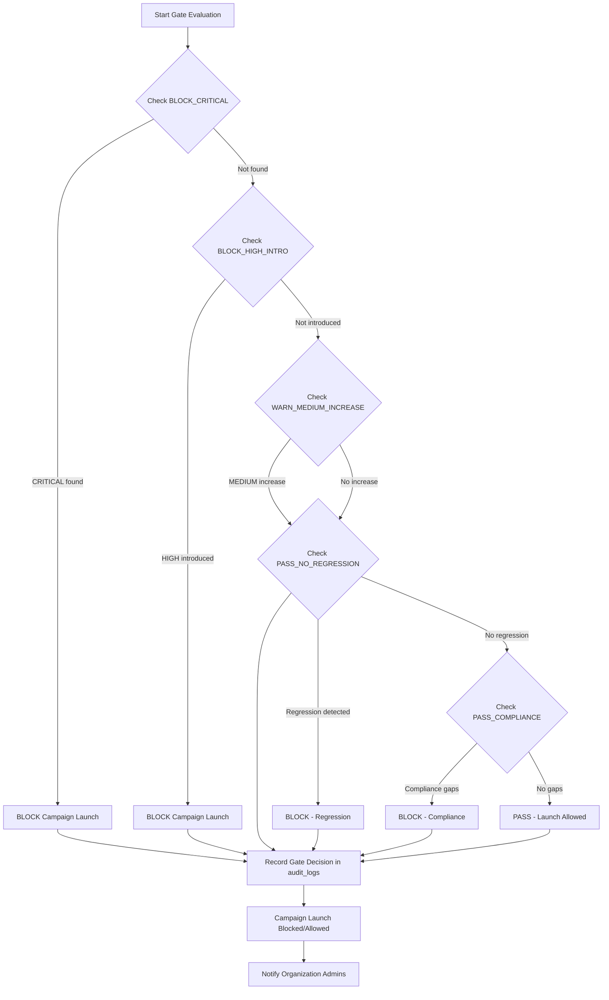

# RedOS Security Gates

## Overview

Security gates are evidence-driven pass/fail conditions that organizations configure to control
when attack campaigns can launch, when findings block progress, and when regressions are detected.

Gates operate on findings, executions, and campaign metadata. Every decision is traceable
to specific evidence items, execution records, and audit logs.

## Gate Configuration

Organizations define gates at the organization level. Gates are inherited by projects and targets
within the organization, but can be overridden at lower levels.

### Gate Definitions

| Gate Type | Condition | Action | Evidence Required |
|-----------|-----------|--------|-------------------|
| `BLOCK_CRITICAL` | `findings.severity = 'CRITICAL'` AND `findings.status = 'active'` | Block campaign launch | finding_id, severity, reproduction_status |
| `BLOCK_HIGH_INTRO` | New `findings.severity = 'HIGH'` AND `findings.discoveredAt > last_campaign_start` | Block campaign launch | finding_id, severity, discoveredAt, prior_campaigns |
| `WARN_MEDIUM_INCREASE` | `findings.severity = 'MEDIUM'` AND count of MEDIUM findings in last 30 days > threshold | Warn but allow launch | finding_id, severity, count_trend, threshold |
| `PASS_NO_REGRESSION` | No new findings with same `title`+``execution_id` combination as prior campaign | Allow launch | finding titles, execution IDs, comparison baseline |
| `PASS_COMPLIANCE` | All findings map to configured `compliance standar d`s with no gaps | Allow launch | finding-compliance mapping, gap analysis |

### Gate Evaluation Order



### Configuration

Gates are configured via JSON in the organization settings:

```json
{
  "organization_id": "org_oid",
  "gates": {
    "BLOCK_CRITICAL": {
      "enabled": true,
      " severity": "CRITICAL",
      "action": "block",
      "message": "Critical finding prevents campaign launch"
    },
    "BLOCK_HIGH_INTRO": {
      "enabled": true,
      "hours_window": 24,
      "action": "block",
      "message": "High severity finding introduced within 24h"
    },
    "WARN_MEDIUM_INCREASE": {
      "enabled": true,
      "threshold": 5,
      "window_days": 30,
      "action": "warn",
      "message": "Medium risk threshold exceeded"
    },
    "PASS_NO_REGRESSION": {
      "enabled": true,
      "action": "pass",
      "message": "No regression detected"
    },
    "PASS_COMPLIANCE": {
      "enabled": false,
      "action": "pass",
      "message": "Compliance check disabled"
    }
  },
  "updated_at": "2024-01-15T10:30:00Z",
  "updated_by": "admin_user_id"
}
```

### API Endpoints

| Method | Endpoint | Description | Auth |
|--------|----------|-------------|------|
| `GET` | `/api/v1/gates/config` | Get organization gate configuration | Bearer JWT |
| `PUT` | `/api/v1/gates/config` | Update gate configuration | Bearer JWT + Admin |
| `POST` | `/api/v1/gates/evaluate` | Evaluate gates for execution | Bearer JWT |

### Audit Logging

Every gate evaluation is logged with:

```json
{
  "user_id": "admin_oid",
  "action": "gate_evaluate",
  "resource_type": "gate",
  "resource_id": "gate_name",
  "details": {
    "gate_name": "BLOCK_CRITICAL",
    "result": "block",
    "findings_triggered": ["finding_oid_1", "finding_oid_2"],
    "campaign_id": "campaign_oid",
    "organization_id": "org_oid"
  },
  "ip_address": "192.168.1.1",
  "user_agent": "Mozilla/5.0...",
  "created_at": "2024-01-15T10:30:00Z"
}
```

## Gate Decision Persistence

Gate decisions are stored in `security.gate_decisions` collection:

```json
{
  "_id": ObjectId(),
  "campaign_id": "campaign_oid",
  "organization_id": "org_oid",
  "evaluated_at": "2024-01-15T10:30:00Z",
  "results": {
    "BLOCK_CRITICAL": {
      "result": "block",
      "triggered": true,
      "triggering_findings": ["finding_oid_1"]
    },
    "BLOCK_HIGH_INTRO": {
      "result": "pass",
      "triggered": false
    },
    "WARN_MEDIUM_INCREASE": {
      "result": "warn",
      "triggered": true,
      "medium_count": 7,
      "threshold": 5
    }
  },
  "final_decision": "block",
  "decision_reason": "BLOCK_CRITICAL triggered",
  "audit trail": ["audit_log_oid_1", "audit_log_oid_2"]
}
```

## Use Cases

### 1. Critical Finding Block
- Team discovers CRITICAL prompt injection vulnerability
- `BLOCK_CRITICAL` gate triggers → campaign launch blocked
- Automated alert sent to organization admins
- Audit log records the finding, decision, and timestamp

### 2. High Finding Introduction
- New HIGH severity finding appears within 24h of prior campaign
- `BLOCK_HIGH_INTRO` gate triggers → campaign blocked
- Window configurable (default 24 hours)
- Prevents rapid-retry of blocked attacks

### 3. Medium Risk Warning
- MEDIUM findings exceed threshold (default 5 in 30 days)
- `WARN_MEDIUM_INCREASE` gate triggers → launch allowed with warning
- Organization notified via configured channels
- Trend tracking enabled for risk assessment

### 3. Regression Detection
- New finding with same title+execution_id as prior campaign
- `PASS_NO_REGRESSION` gate fails → campaign blocked
- Ensures fixes are verified before re-execution

### 4. Compliance Verification
- All findings mapped to compliance standards (SOC2, ISO27001, etc.)
- `PASS_COMPLIANCE` gate checks for gaps
- Currently configurable; can be disabled per organization

## Implementation

### Gate Evaluation Service

```python
# Pseudocode - evaluates all enabled gates for a campaign
def evaluate_campaign_gates(campaign_id, organization_id):
    gates = GATE_CONFIG[organization_id]
    results = {}
    triggered_findings = {}
    
    # BLOCK_CRITICAL
    if gates['BLOCK_CRITICAL']['enabled']:
        critical_findings = db.findings.find({
            'campaign_id': campaign_id,
            'severity': 'CRITICAL',
            'status': 'active'
        })
        results['BLOCK_CRITICAL'] = {
            'result': 'block' if critical_findings else 'pass',
            'triggered': len(critical_findings) > 0,
            'triggering_findings': [f['_id'] for f in critical_findings]
        }
        if results['BLOCK_CRITICAL']['triggered']:
            triggered_findings['BLOCK_CRITICAL'] = critical_findings
    
    # BLOCK_HIGH_INTRO
    if gates['BLOCK_HIGH_INTRO']['enabled']:
        window = timedelta(hours=gates['BLOCK_HIGH_INTRO']['hours_window'])
        recent_findings = db.findings.find({
            'campaign_id': campaign_id,
            'severity': 'HIGH',
            'discoveredAt': {'$gt': datetime.now() - window}
        })
        results['BLOCK_HIGH_INTRO'] = {
            'result': 'block' if recent_findings else 'pass',
            'triggered': len(recent_findings) > 0,
            'triggering_findings': [f['_id'] for f in recent_findings]
        }
    
    # ... similar for other gates
    
    # Final decision
    final_decision = 'pass'
    reason = ''
    for gate_name, gate_result in results.items():
        if gate_result['result'] == 'block':
            final_decision = 'block'
            reason = f"{gate_name} triggered"
            break
        elif gate_result['result'] == 'warn':
            final_decision = 'warn'
            reason = f"{gate_name} warning"
    
    # Persist decision
    gate_decision = {
        'campaign_id': campaign_id,
        'organization_id': organization_id,
        'results': results,
        'final_decision': final_decision,
        'decision_reason': reason,
        'evaluated_at': datetime.now()
    }
    db.gate_decisions.insert_one(gate_decision)
    
    return gate_decision
```

### Frontend Display

Gate status displayed on campaign creation/launch page:

```
┌─────────────────────────────────────────┐
│ GATE STATUS                              │
├─────────────────────────────────────────┤
│ BLOCK_CRITICAL: ✅ PASS                  │
│ BLOCK_HIGH_INTRO: ✅ PASS                │
│ WARN_MEDIUM_INCREASE: ⚠️ WARN (3/5)      │
│ PASS_NO_REGRESSION: ✅ PASS              │
│ PASS_COMPLIANCE: ✅ PASS                 │
├─────────────────────────────────────────┤
│ [Launch Campaign]  [Cancel]             │
└─────────────────────────────────────────┘
```

## Policy as Code

Organizations can export gate configurations as JSON and version-control them:

```bash
# Export gate config
redos-cli gates export --org org_oid --file gates.json

# Version control
git add gates.json
git commit -m "Update critical finding block threshold"

# Import to another org
redos-cli gates import --org org_oid_2 --file gates.json
```

This enables:
- Gate configuration as code
- Review and approval workflows
- Change tracking and audit
- Multi-organization consistency